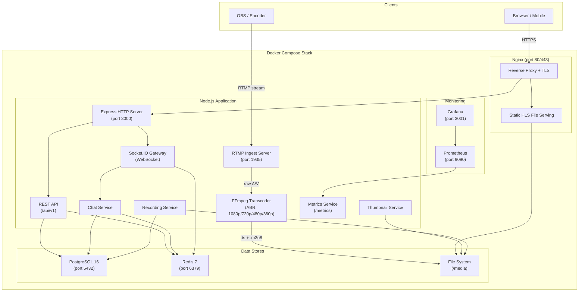

# HLS Streaming Server


A production-grade live video streaming server with RTMP ingest, FFmpeg adaptive bitrate transcoding, HLS delivery, real-time chat, viewer analytics, VOD recording, and a monitoring stack. Built as a project to demonstrate expertise in system design, real-time communication, media processing, and containerized deployment.

---

## Table of Contents

- [Overview](#overview)
- [Key Features](#key-features)
- [System Architecture](#system-architecture)
- [Tech Stack](#tech-stack)
- [Project Structure](#project-structure)
- [Prerequisites](#prerequisites)
- [Quick Start](#quick-start)
- [Environment Variables](#environment-variables)
- [API Endpoints](#api-endpoints)
- [Roadmap](#roadmap)
- [License](#license)

---

## Overview

This project implements a complete live streaming platform from ingest to playback. A broadcaster pushes an RTMP stream (via OBS or similar software), the server transcodes it into multiple quality levels using FFmpeg, packages it as HLS, and serves it to viewers over HTTP. The platform includes user authentication, live chat, real-time analytics, stream recording for video-on-demand, and a full monitoring stack with Prometheus and Grafana.

### Why This Project?

Live video streaming sits at the intersection of several challenging domains:

- **Media Engineering** — Real-time video transcoding, codec configuration, adaptive bitrate ladders
- **Distributed Systems** — Multi-process orchestration (RTMP server, FFmpeg workers, HTTP server, WebSocket gateway)
- **Real-Time Communication** — WebSocket-based chat and live viewer analytics
- **Database Design** — Relational modeling for users, streams, sessions, analytics events, and chat history
- **DevOps** — Multi-service Docker Compose orchestration with monitoring and reverse proxying
- **Security** — JWT authentication, stream key management, rate limiting, input validation

---

## Key Features

| Category | Features |
|---|---|
| **Streaming** | RTMP ingest (port 1935), FFmpeg adaptive bitrate transcoding (1080p / 720p / 480p / 360p), HLS delivery with master playlist |
| **Authentication** | JWT access + refresh tokens, bcrypt password hashing, role-based access control (admin / streamer / viewer), stream key generation and rotation |
| **Live Chat** | Room-per-stream architecture via Socket.IO, message persistence, rate limiting, moderation (ban/mute/delete), slow mode |
| **Analytics** | Real-time viewer counts, peak/total viewers per session, stream health metrics (bitrate, FPS), server resource monitoring |
| **Dashboard** | React admin dashboard with real-time charts, stream management, user management, system metrics |
| **VOD / Recording** | Automatic stream archival, MP4 conversion, HLS VOD playlists, thumbnail sprite sheets |
| **Thumbnails** | Periodic live screenshot capture (every 30s) for stream previews |
| **Monitoring** | Prometheus metrics collection, Grafana dashboards, health check endpoints |
| **Infrastructure** | Docker Compose with 6 services, Nginx reverse proxy with TLS, multi-stage Docker builds |

---

## System Architecture



> For full architecture details, sequence diagrams, ER diagrams, and more, see **[docs/architecture/ARCHITECTURE.md](docs/architecture/ARCHITECTURE.md)**.

---

## Tech Stack

### Backend

| Component | Technology | Purpose |
|---|---|---|
| Runtime | Node.js 20 LTS | Event-driven, non-blocking I/O for streaming workloads |
| Language | TypeScript 5.x | Type safety, interfaces, enums for robust codebase |
| HTTP Framework | Express.js 4.x | REST API, middleware ecosystem |
| RTMP Server | node-media-server | RTMP ingest with lifecycle hooks |
| Transcoding | FFmpeg 6.x + fluent-ffmpeg | Adaptive bitrate HLS transcoding |
| WebSocket | Socket.IO 4.x | Real-time chat, viewer counts, dashboard |
| ORM | Prisma 5.x | Type-safe database queries, migrations |
| Validation | Zod | Request/response schema validation |
| Auth | jsonwebtoken + bcryptjs | JWT tokens, password hashing |
| Logging | Pino | Fast structured JSON logging |
| Metrics | prom-client | Prometheus-compatible metrics |
| Job Queue | BullMQ | Background jobs (recording, thumbnails) |
| Rate Limiting | express-rate-limit | API and connection rate limiting |

### Data Layer

| Component | Technology | Purpose |
|---|---|---|
| Primary Database | PostgreSQL 16 | Users, streams, sessions, analytics, chat |
| Cache / Sessions | Redis 7 | JWT sessions, viewer tracking, pub/sub, BullMQ backend |
| File Storage | Local filesystem / S3 | HLS segments, recordings, thumbnails |

### Frontend

| Component | Technology | Purpose |
|---|---|---|
| Framework | Next.js 15 (App Router) | SSR, routing, API proxy |
| Language | TypeScript 5.x | Type safety across the frontend |
| UI Components | shadcn/ui (Radix) | Accessible, composable primitives |
| Icons | Lucide React | Consistent iconography |
| Styling | Tailwind CSS 3.x | Utility-first responsive design |
| UI State | Redux Toolkit | Slices for auth, UI, player state |
| Server State | RTK Query | API caching, polling, cache invalidation |
| Side Effects | Redux-Saga | WebSocket lifecycle, multi-step workflows |
| Video Player | HLS.js | Adaptive bitrate HLS playback |
| Charts | Recharts | Real-time analytics visualization |
| WebSocket Client | socket.io-client | Real-time updates |

### Infrastructure

| Component | Technology | Purpose |
|---|---|---|
| Containerization | Docker + Docker Compose | Multi-service orchestration |
| Reverse Proxy | Nginx | TLS termination, static file serving, load balancing |
| Metrics | Prometheus | Time-series metrics scraping |
| Dashboards | Grafana | Metrics visualization and alerting |
| CI/CD | GitHub Actions | Automated testing, linting, Docker builds |

---

## Project Structure

```
hls-streaming-server/
├── docker/
│   ├── nginx/
│   │   ├── nginx.conf
│   │   └── mime.types
│   ├── prometheus/
│   │   └── prometheus.yml
│   └── grafana/
│       ├── dashboards/
│       │   └── streaming.json
│       └── datasources/
│           └── prometheus.yml
│
├── src/
│   ├── config/
│   │   ├── index.ts                 # Centralized config (env vars)
│   │   ├── database.ts              # Prisma client initialization
│   │   ├── redis.ts                 # Redis client initialization
│   │   ├── ffmpeg.ts                # FFmpeg path and options
│   │   └── constants.ts             # App-wide constants
│   │
│   ├── modules/                     # Feature modules
│   │   ├── auth/
│   │   │   ├── auth.controller.ts
│   │   │   ├── auth.service.ts
│   │   │   ├── auth.middleware.ts
│   │   │   ├── auth.routes.ts
│   │   │   ├── auth.validator.ts
│   │   │   └── auth.types.ts
│   │   ├── users/
│   │   │   ├── users.controller.ts
│   │   │   ├── users.service.ts
│   │   │   ├── users.repository.ts
│   │   │   ├── users.routes.ts
│   │   │   ├── users.validator.ts
│   │   │   └── users.types.ts
│   │   ├── streams/
│   │   │   ├── streams.controller.ts
│   │   │   ├── streams.service.ts
│   │   │   ├── streams.repository.ts
│   │   │   ├── streams.routes.ts
│   │   │   ├── streams.validator.ts
│   │   │   └── streams.types.ts
│   │   ├── chat/
│   │   │   ├── chat.gateway.ts
│   │   │   ├── chat.service.ts
│   │   │   ├── chat.repository.ts
│   │   │   └── chat.types.ts
│   │   ├── analytics/
│   │   │   ├── analytics.controller.ts
│   │   │   ├── analytics.service.ts
│   │   │   ├── analytics.repository.ts
│   │   │   ├── analytics.routes.ts
│   │   │   └── analytics.types.ts
│   │   ├── vod/
│   │   │   ├── vod.controller.ts
│   │   │   ├── vod.service.ts
│   │   │   ├── vod.repository.ts
│   │   │   ├── vod.routes.ts
│   │   │   └── vod.types.ts
│   │   └── thumbnails/
│   │       ├── thumbnails.service.ts
│   │       └── thumbnails.types.ts
│   │
│   ├── services/                    # Core infrastructure services
│   │   ├── rtmp/
│   │   │   ├── rtmp.server.ts
│   │   │   ├── rtmp.auth.ts
│   │   │   └── rtmp.events.ts
│   │   ├── transcoding/
│   │   │   ├── transcoder.ts
│   │   │   ├── transcoder.presets.ts
│   │   │   └── transcoder.monitor.ts
│   │   ├── websocket/
│   │   │   ├── socket.server.ts
│   │   │   ├── socket.middleware.ts
│   │   │   └── socket.events.ts
│   │   ├── queue/
│   │   │   ├── queue.manager.ts
│   │   │   └── jobs/
│   │   │       ├── recording.job.ts
│   │   │       └── thumbnail.job.ts
│   │   └── metrics/
│   │       ├── metrics.service.ts
│   │       └── metrics.routes.ts
│   │
│   ├── common/
│   │   ├── middleware/
│   │   │   ├── error-handler.ts
│   │   │   ├── request-logger.ts
│   │   │   ├── rate-limiter.ts
│   │   │   └── cors.ts
│   │   ├── utils/
│   │   │   ├── logger.ts
│   │   │   ├── crypto.ts
│   │   │   ├── response.ts
│   │   │   └── errors.ts
│   │   ├── interfaces/
│   │   │   ├── request.ts
│   │   │   ├── pagination.ts
│   │   │   └── api-response.ts
│   │   └── events/
│   │       ├── event-bus.ts
│   │       └── event-types.ts
│   │
│   ├── database/
│   │   └── prisma/
│   │       ├── schema.prisma
│   │       ├── migrations/
│   │       └── seed.ts
│   │
│   ├── app.ts                       # Express app setup
│   └── server.ts                    # Entry point (boots all services)
│
├── client/                          # Next.js frontend
│   ├── src/
│   │   ├── app/                     # App Router pages & layouts
│   │   │   ├── (auth)/              # Login, Register
│   │   │   ├── (main)/              # Dashboard, Streams, VOD, Users, Settings
│   │   │   ├── globals.css
│   │   │   ├── layout.tsx
│   │   │   └── page.tsx
│   │   ├── components/
│   │   │   ├── ui/                  # shadcn/ui primitives
│   │   │   ├── layout/              # Sidebar, Topbar
│   │   │   ├── auth/                # Login/Register forms, AuthGuard
│   │   │   ├── dashboard/           # Stats, charts, stream table
│   │   │   ├── streams/             # Stream cards, grid, settings
│   │   │   ├── player/              # HLS.js player, controls, quality
│   │   │   ├── chat/                # Chat panel, messages, input
│   │   │   ├── analytics/           # Viewer timeline, session history
│   │   │   ├── vod/                 # VOD cards, grid
│   │   │   ├── users/               # User table, role/delete dialogs
│   │   │   ├── settings/            # Profile, stream settings forms
│   │   │   └── shared/              # DataTable, StatCard, ErrorBoundary
│   │   ├── store/
│   │   │   ├── api/                 # RTK Query API slices
│   │   │   ├── slices/              # Redux Toolkit state slices
│   │   │   ├── sagas/               # Redux-Saga (socket, auth, chat)
│   │   │   ├── index.ts             # Store configuration
│   │   │   ├── root-saga.ts
│   │   │   └── provider.tsx
│   │   ├── types/                   # API & socket TypeScript types
│   │   └── lib/                     # Utils, constants
│   ├── package.json
│   ├── tsconfig.json
│   ├── next.config.ts
│   ├── tailwind.config.ts
│   └── components.json              # shadcn/ui config
│
├── tests/
│   ├── unit/
│   ├── integration/
│   ├── e2e/
│   ├── fixtures/
│   └── helpers/
│
├── docs/
│   └── architecture/
│       └── ARCHITECTURE.md
│
├── scripts/
│   ├── generate-stream-key.ts
│   ├── seed-database.ts
│   └── load-test.ts
│
├── .github/
│   └── workflows/
│       ├── ci.yml
│       └── docker-build.yml
│
├── docker-compose.yml
├── docker-compose.dev.yml
├── Dockerfile
├── .env.example
├── .gitignore
├── tsconfig.json
├── package.json
└── README.md
```

---

## Prerequisites

| Requirement | Version | Notes |
|---|---|---|
| Node.js | 20 LTS+ | Runtime |
| FFmpeg | 6.x+ | Must be in system PATH |
| Docker | 24+ | For containerized deployment |
| Docker Compose | 2.20+ | Multi-service orchestration |
| PostgreSQL | 16+ | Only if running without Docker |
| Redis | 7+ | Only if running without Docker |

---

## Quick Start

### Option 1: Docker Compose (Recommended)

```bash
# Clone the repository
git clone https://github.com/your-username/hls-streaming-server.git
cd hls-streaming-server

# Copy environment file
cp .env.example .env

# Start all services
docker compose up -d

# Run database migrations
docker compose exec app npx prisma migrate deploy

# Seed the database (creates admin user)
docker compose exec app npx prisma db seed
```

The services will be available at:

| Service | URL |
|---|---|
| Web Interface | http://localhost |
| REST API | http://localhost/api/v1 |
| RTMP Ingest | rtmp://localhost:1935/live/{stream_key} |
| Grafana | http://localhost:3001 |
| Prometheus | http://localhost:9090 |

### Option 2: Manual Setup

```bash
# Install dependencies
pnpm install

# Set up environment
cp .env.example .env
# Edit .env with your PostgreSQL and Redis connection strings

# Run database migrations
npx prisma migrate deploy

# Seed the database
npx prisma db seed

# Start in development mode
pnpm dev
```

### Default Credentials

After seeding the database, the following accounts are available:

| Role | Email | Password |
|---|---|---|
| Admin | `admin@hls-stream.local` | `admin123` |
| Streamer | `streamer@hls-stream.local` | `streamer123` |
| Viewer | `viewer@hls-stream.local` | `viewer123` |

### Start Streaming

1. Create an account and log in to the dashboard
2. Navigate to Stream Settings and copy your stream key
3. Open OBS Studio and configure:
   - **Server:** `rtmp://localhost:1935/live`
   - **Stream Key:** paste your key
4. Click "Start Streaming" in OBS
5. Open `http://localhost/watch/{stream_id}` in a browser to view

---

## Environment Variables

| Variable | Default | Description |
|---|---|---|
| `NODE_ENV` | `development` | Environment (development / production) |
| `PORT` | `3000` | HTTP server port |
| `RTMP_PORT` | `1935` | RTMP ingest port |
| `DATABASE_URL` | — | PostgreSQL connection string |
| `REDIS_URL` | `redis://localhost:6379` | Redis connection string |
| `JWT_SECRET` | — | Secret key for JWT signing |
| `JWT_EXPIRES_IN` | `24h` | Access token expiration |
| `JWT_REFRESH_EXPIRES_IN` | `7d` | Refresh token expiration |
| `FFMPEG_PATH` | `ffmpeg` | Path to FFmpeg binary |
| `MEDIA_ROOT` | `./media` | Root directory for HLS segments and recordings |
| `HLS_SEGMENT_DURATION` | `6` | HLS segment length in seconds |
| `HLS_PLAYLIST_SIZE` | `10` | Number of segments in live playlist |
| `THUMBNAIL_INTERVAL` | `30` | Seconds between thumbnail captures |
| `MAX_STREAMS` | `10` | Maximum concurrent streams allowed |
| `CORS_ORIGIN` | `*` | Allowed CORS origins |

---

## API Endpoints

All endpoints are prefixed with `/api/v1`.

### Authentication

| Method | Endpoint | Description | Auth |
|---|---|---|---|
| POST | `/auth/register` | Create new account | No |
| POST | `/auth/login` | Log in, receive tokens | No |
| POST | `/auth/refresh` | Refresh access token | Refresh Token |
| POST | `/auth/logout` | Invalidate tokens | Yes |
| GET | `/auth/me` | Get current user | Yes |

### Streams

| Method | Endpoint | Description | Auth |
|---|---|---|---|
| GET | `/streams` | List live streams | No |
| POST | `/streams` | Create a stream | Streamer |
| GET | `/streams/:id` | Get stream details | No |
| PATCH | `/streams/:id` | Update stream info | Owner |
| DELETE | `/streams/:id` | Delete stream | Owner / Admin |
| GET | `/streams/:id/key` | Get stream key | Owner |
| POST | `/streams/:id/key` | Regenerate stream key | Owner |

### Analytics

| Method | Endpoint | Description | Auth |
|---|---|---|---|
| GET | `/analytics/streams/:id` | Stream analytics summary | Owner / Admin |
| GET | `/analytics/streams/:id/viewers` | Viewer history | Owner / Admin |
| GET | `/analytics/streams/:id/sessions` | Past sessions | Owner / Admin |
| GET | `/analytics/dashboard` | Server-wide metrics | Admin |

### Chat

| Method | Endpoint | Description | Auth |
|---|---|---|---|
| GET | `/streams/:id/chat` | Recent chat messages | No |
| POST | `/streams/:id/chat/ban` | Ban a user from chat | Owner / Admin |
| DELETE | `/streams/:id/chat/ban/:userId` | Unban a user | Owner / Admin |
| DELETE | `/streams/:id/chat/:messageId` | Delete a message | Owner / Admin |

### VOD

| Method | Endpoint | Description | Auth |
|---|---|---|---|
| GET | `/vod` | List recordings | No |
| GET | `/vod/:id` | Get recording details | No |
| DELETE | `/vod/:id` | Delete a recording | Owner / Admin |
| GET | `/vod/:id/manifest` | Get HLS VOD manifest | No |

### Infrastructure

| Method | Endpoint | Description | Auth |
|---|---|---|---|
| GET | `/health` | Health check | No |
| GET | `/metrics` | Prometheus metrics | No |

---

## Roadmap

| Phase | Focus | Description |
|---|---|---|
| **Phase 1: Foundation** | Project Setup | TypeScript scaffolding, Docker Compose, Prisma schema, Express server, user auth, config management |
| **Phase 2: Core Streaming** | RTMP + HLS | RTMP ingest, stream key validation, FFmpeg ABR transcoding, HLS serving, stream lifecycle events |
| **Phase 3: Real-Time** | WebSocket | Socket.IO setup, viewer counts, chat system with rooms and moderation |
| **Phase 4: Analytics** | Dashboard | Viewer event logging, analytics API, React admin dashboard, Prometheus + Grafana |
| **Phase 5: VOD** | Recording | Stream archival, MP4 conversion, VOD playlists, thumbnail generation, BullMQ jobs |
| **Phase 6: Polish** | Production | Nginx proxy, Docker optimization, tests, load testing, OpenAPI docs, security hardening |

---

## License

This project is licensed under the MIT License. See [LICENSE](LICENSE) for details.
