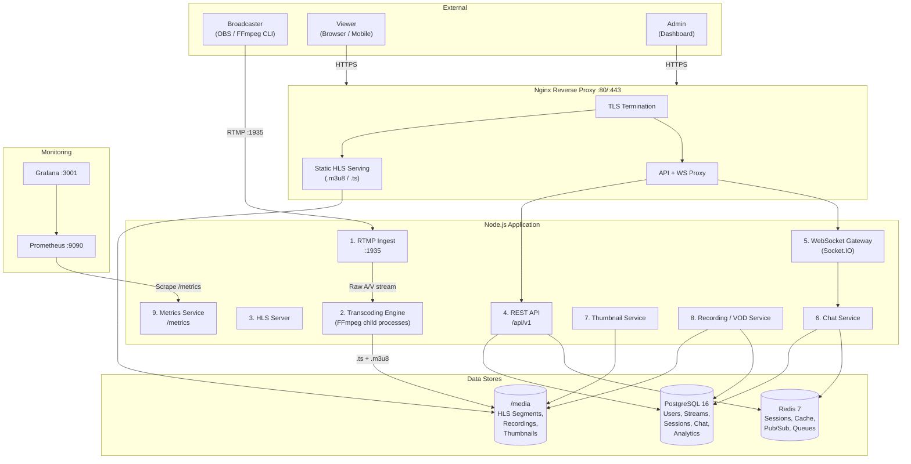
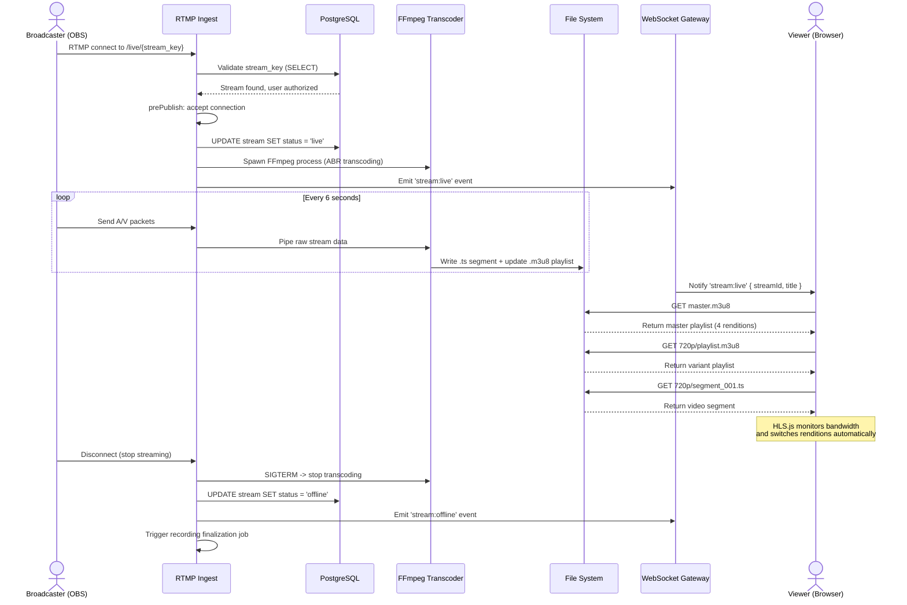
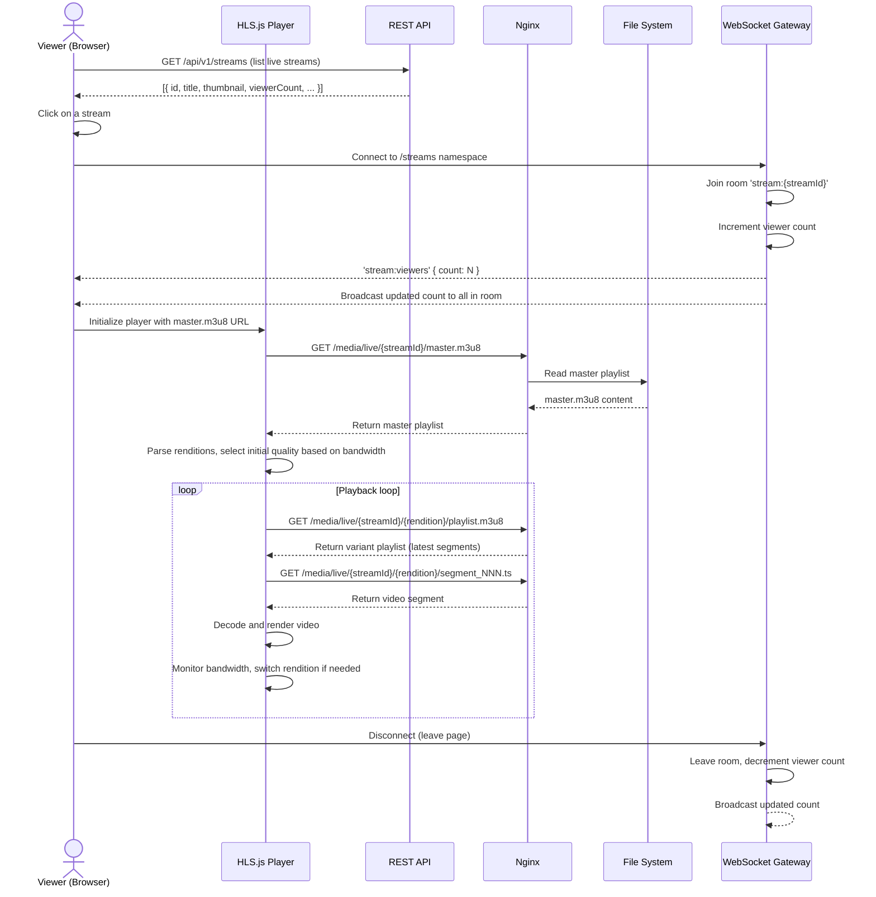
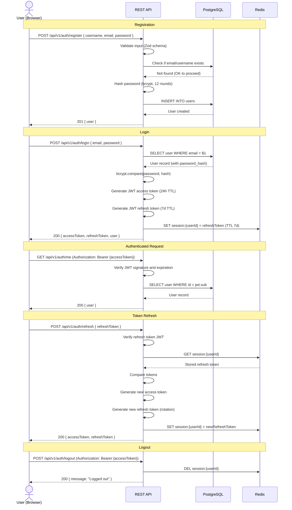
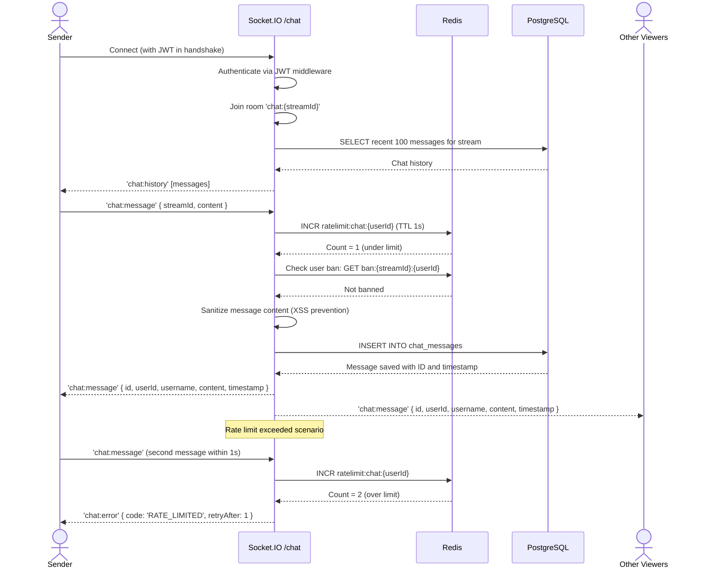
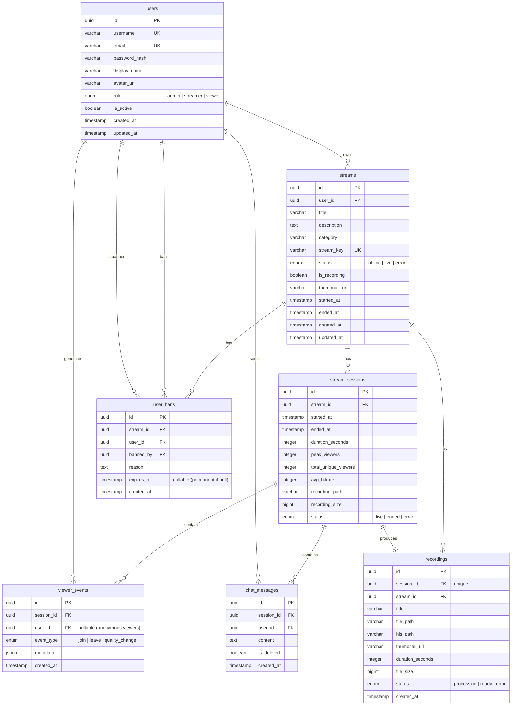
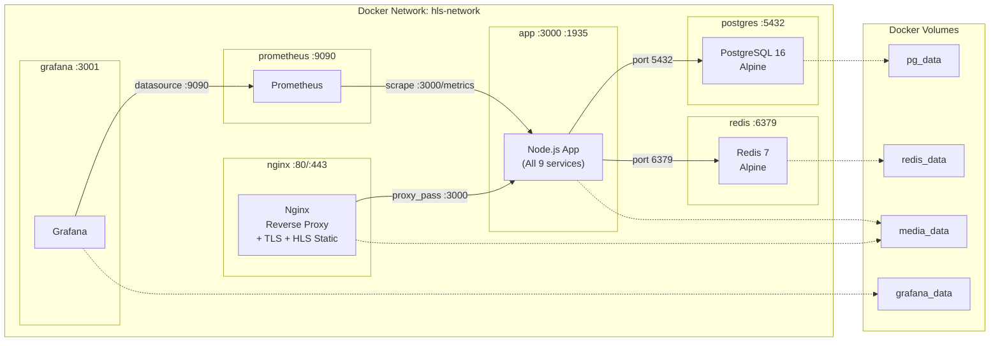

# System Architecture

This document describes the complete system architecture of the HLS Streaming Server, including service design, data flows, database schema, API contracts, WebSocket events, deployment topology, and security considerations.

---

## Table of Contents

- [1. System Overview](#1-system-overview)
- [2. Service Descriptions](#2-service-descriptions)
- [3. Data Flow Diagrams](#3-data-flow-diagrams)
- [4. Adaptive Bitrate Transcoding](#4-adaptive-bitrate-transcoding)
- [5. Database Design](#5-database-design)
- [6. API Design](#6-api-design)
- [7. WebSocket Event Architecture](#7-websocket-event-architecture)
- [8. Docker Deployment](#8-docker-deployment)
- [9. Security](#9-security)
- [10. Monitoring and Observability](#10-monitoring-and-observability)

---

## 1. System Overview

The system is composed of 9 logical services running within a Docker Compose stack, backed by PostgreSQL, Redis, and the local file system.



---

## 2. Service Descriptions

### 2.1 RTMP Ingest Service

**Technology:** node-media-server  
**Port:** 1935  
**Responsibility:** Accepts RTMP connections from broadcasters, validates stream keys, and emits lifecycle events.

**Lifecycle Hooks:**

| Event | Action |
|---|---|
| `preConnect` | IP rate limiting, connection logging |
| `prePublish` | Extract stream key from URL path, validate against database |
| `postPublish` | Update stream status to `live`, spawn FFmpeg transcoder, notify WebSocket clients, start thumbnail job |
| `donePublish` | Stop FFmpeg process, finalize recording, update status to `offline`, cleanup old segments |
| `prePlay` | Optional viewer authentication for private streams |

**Stream URL Format:**
```
rtmp://server:1935/live/{stream_key}
```

### 2.2 Transcoding Engine

**Technology:** FFmpeg 6.x via child_process.spawn  
**Responsibility:** Converts the incoming RTMP stream into multiple HLS renditions (adaptive bitrate).

**Key Design Decisions:**
- One FFmpeg process per active stream
- `-preset veryfast` for real-time encoding
- 2-second keyframe interval (GOP = framerate x 2) for clean segment boundaries
- 6-second HLS segments balancing latency vs. buffering
- `delete_segments` flag prevents disk from filling during long streams
- `independent_segments` tag allows clean rendition switching

**Process Management:**
- Monitor FFmpeg stderr for progress and errors
- Automatic restart on crash with exponential backoff (max 3 retries)
- Track CPU usage per process; reject new streams if server is overloaded
- Graceful shutdown: send SIGTERM, wait 5s, then SIGKILL

### 2.3 HLS Server

**Responsibility:** Serves HLS playlists (.m3u8) and segments (.ts) over HTTP.

**MIME Types:**
- `.m3u8` -> `application/vnd.apple.mpegurl`
- `.ts` -> `video/mp2t`

**Cache Headers:**
- Live playlists: `Cache-Control: no-cache` (must re-fetch for latest segments)
- Segments: `Cache-Control: public, max-age=86400` (immutable once written)

**Directory Layout:**
```
/media/
  live/{stream_id}/
    master.m3u8              # Master playlist (references all renditions)
    0/playlist.m3u8          # 1080p variant playlist
    0/segment_001.ts         # 1080p segments
    1/playlist.m3u8          # 720p
    2/playlist.m3u8          # 480p
    3/playlist.m3u8          # 360p
  vod/{stream_id}/
    master.m3u8              # Complete VOD playlist
    ...all segments...
  thumbnails/{stream_id}/
    latest.jpg               # Most recent thumbnail
```

### 2.4 REST API

**Technology:** Express.js 4.x  
**Prefix:** `/api/v1`  
**Responsibility:** CRUD operations for users, streams, analytics, chat moderation, and VOD management.

**Middleware Chain:**
1. CORS
2. Request logging (Pino)
3. Body parsing (JSON, 10MB limit)
4. Rate limiting
5. JWT authentication (where required)
6. Role-based authorization
7. Request validation (Zod)
8. Controller handler
9. Error handler (centralized)

### 2.5 WebSocket Gateway

**Technology:** Socket.IO 4.x  
**Responsibility:** Real-time bidirectional communication for viewer counts, stream events, and dashboard metrics.

**Namespace Architecture:**
- `/streams` — Stream lifecycle events and viewer tracking
- `/chat` — Chat messages per stream room
- `/dashboard` — Admin/streamer analytics and server metrics

### 2.6 Chat Service

**Responsibility:** Room-based live chat per stream.

**Features:**
- Room-per-stream using Socket.IO rooms (`stream:{streamId}`)
- Message persistence to PostgreSQL (latest 100 messages loaded on room join)
- Rate limiting: max 1 message per second per user (via Redis counter)
- Moderation: ban/mute users, delete messages (streamer or admin permissions)
- System messages for stream events (e.g., "Stream started", "User was banned")
- Configurable slow mode (delay between messages per user)

### 2.7 Thumbnail Service

**Technology:** FFmpeg (single-frame capture)  
**Responsibility:** Captures periodic screenshots from live streams for preview images.

**Process:**
```bash
ffmpeg -i /media/live/{stream_id}/0/playlist.m3u8 \
  -vframes 1 -vf "scale=640:360" -update 1 \
  /media/thumbnails/{stream_id}/latest.jpg
```
- Runs every 30 seconds as a BullMQ repeatable job
- Output overwrites the previous thumbnail
- Thumbnail URL is stored in the stream record for API responses

### 2.8 Recording / VOD Service

**Responsibility:** Archives live streams for video-on-demand playback.

**Pipeline:**
1. Stream starts -> transcoding engine writes segments to `/media/live/{stream_id}/`
2. Simultaneously, a recording worker copies segments to `/media/recording/{stream_id}/`
3. Stream ends -> `donePublish` event fires
4. BullMQ job: concatenate all `.ts` segments into a single MP4 file
5. Generate a complete HLS VOD playlist (`hls_list_size 0` = all segments)
6. Generate thumbnail sprite sheet for seek preview
7. Update database: recording status = `ready`, file paths, duration, file size

### 2.9 Metrics Service

**Technology:** prom-client  
**Endpoint:** `GET /metrics`  
**Responsibility:** Exposes Prometheus-compatible metrics for scraping.

---

## 3. Data Flow Diagrams

### 3.1 Stream Publish Flow



### 3.2 Viewer Playback Flow



### 3.3 Authentication Flow



### 3.4 Chat Message Flow



---

## 4. Adaptive Bitrate Transcoding

### 4.1 ABR Ladder

| Rendition | Resolution | Video Bitrate | Audio Bitrate | Video Profile | Keyframe Interval | Preset |
|---|---|---|---|---|---|---|
| 1080p | 1920x1080 | 5000 kbps | 192 kbps | High | 2s (GOP = fps x 2) | veryfast |
| 720p | 1280x720 | 2800 kbps | 128 kbps | Main | 2s | veryfast |
| 480p | 854x480 | 1400 kbps | 128 kbps | Main | 2s | veryfast |
| 360p | 640x360 | 800 kbps | 96 kbps | Baseline | 2s | veryfast |

### 4.2 FFmpeg Command

```bash
ffmpeg -i rtmp://localhost:1935/live/{stream_key} \
  -filter_complex "[v:0]split=4[v1][v2][v3][v4]; \
    [v1]scale=1920:1080[v1out]; \
    [v2]scale=1280:720[v2out]; \
    [v3]scale=854:480[v3out]; \
    [v4]scale=640:360[v4out]" \
  \
  -map "[v1out]" -c:v:0 libx264 -b:v:0 5000k -preset veryfast -profile:v high \
  -map "[v2out]" -c:v:1 libx264 -b:v:1 2800k -preset veryfast -profile:v main \
  -map "[v3out]" -c:v:2 libx264 -b:v:2 1400k -preset veryfast -profile:v main \
  -map "[v4out]" -c:v:3 libx264 -b:v:3 800k  -preset veryfast -profile:v baseline \
  \
  -map a:0 -c:a:0 aac -b:a:0 192k \
  -map a:0 -c:a:1 aac -b:a:1 128k \
  -map a:0 -c:a:2 aac -b:a:2 128k \
  -map a:0 -c:a:3 aac -b:a:3 96k \
  \
  -f hls \
  -hls_time 6 \
  -hls_list_size 10 \
  -hls_flags delete_segments+independent_segments \
  -hls_segment_type mpegts \
  -master_pl_name master.m3u8 \
  -var_stream_map "v:0,a:0 v:1,a:1 v:2,a:2 v:3,a:3" \
  -hls_segment_filename '/media/live/{stream_id}/%v/segment_%03d.ts' \
  '/media/live/{stream_id}/%v/playlist.m3u8'
```

### 4.3 Master Playlist Example

```m3u8
#EXTM3U
#EXT-X-VERSION:3
#EXT-X-STREAM-INF:BANDWIDTH=5192000,RESOLUTION=1920x1080,CODECS="avc1.640028,mp4a.40.2"
0/playlist.m3u8
#EXT-X-STREAM-INF:BANDWIDTH=2928000,RESOLUTION=1280x720,CODECS="avc1.4d401f,mp4a.40.2"
1/playlist.m3u8
#EXT-X-STREAM-INF:BANDWIDTH=1528000,RESOLUTION=854x480,CODECS="avc1.4d401e,mp4a.40.2"
2/playlist.m3u8
#EXT-X-STREAM-INF:BANDWIDTH=896000,RESOLUTION=640x360,CODECS="avc1.42e015,mp4a.40.2"
3/playlist.m3u8
```

---

## 5. Database Design

### 5.1 Entity-Relationship Diagram



### 5.2 Table Details

#### users
Primary user accounts table. Supports three roles: `admin` (full access), `streamer` (can broadcast and manage own streams), `viewer` (can watch and chat).

#### streams
Each streamer has one stream configuration. The `stream_key` is a UUIDv4, stored hashed. Can be regenerated (rotated) at any time. The `status` field tracks whether the stream is currently live.

#### stream_sessions
Created each time a stream goes live. Tracks session-level metrics including peak viewers, duration, and average bitrate. Links to the recording if one was produced.

#### viewer_events
Granular analytics events. Each viewer join/leave/quality change is logged. The `metadata` JSONB field stores context-specific data (e.g., selected quality, user agent, geographic region).

#### chat_messages
Persisted chat messages. Soft-deleted via `is_deleted` flag so moderation actions are auditable.

#### user_bans
Stream-scoped bans. A user can be banned from specific streams. Supports both temporary (with `expires_at`) and permanent bans. `UNIQUE(stream_id, user_id)` prevents duplicate ban entries.

#### recordings
One recording per stream session. Tracks the processing pipeline status from `processing` to `ready`. Stores file paths for both the raw MP4 and HLS VOD manifest.

### 5.3 Redis Data Structures

```
# Session Management
session:{userId}              STRING  -> Refresh token (TTL 7 days)

# Viewer Tracking
viewers:{streamId}            SET     -> Set of socket IDs or user IDs
viewer_count:{streamId}       STRING  -> Denormalized integer count

# Stream State (fast lookup, avoids DB hits)
stream:status:{streamId}      STRING  -> "live" | "offline"
stream:meta:{streamId}        HASH    -> { title, streamer, category, thumbnail, viewers }

# Rate Limiting
ratelimit:chat:{userId}       STRING  -> Message count (TTL 1 second)
ratelimit:api:{ip}            STRING  -> Request count (TTL 60 seconds)

# Pub/Sub Channels
channel:stream_events                 -> Stream started/stopped notifications
channel:chat:{streamId}              -> Chat messages (cross-process distribution)
channel:admin_metrics                 -> Server metrics broadcast
```

---

## 6. API Design

### 6.1 Base URL

```
/api/v1
```

### 6.2 Standard Response Format

**Success:**
```json
{
  "success": true,
  "data": { ... },
  "meta": {
    "page": 1,
    "limit": 20,
    "total": 150,
    "totalPages": 8
  }
}
```

**Error:**
```json
{
  "success": false,
  "error": {
    "code": "STREAM_NOT_FOUND",
    "message": "The requested stream does not exist.",
    "status": 404
  }
}
```

### 6.3 Error Codes

| HTTP Status | Error Code | Description |
|---|---|---|
| 400 | `VALIDATION_ERROR` | Request body or parameters failed validation |
| 401 | `UNAUTHORIZED` | Missing or invalid authentication token |
| 403 | `FORBIDDEN` | Authenticated but insufficient permissions |
| 404 | `NOT_FOUND` | Resource does not exist |
| 409 | `CONFLICT` | Resource already exists (e.g., duplicate email) |
| 429 | `RATE_LIMITED` | Too many requests |
| 500 | `INTERNAL_ERROR` | Unexpected server error |

### 6.4 Endpoint Groups

**Authentication:** Register, login, refresh, logout, get current user  
**Users (admin):** List, get, update, delete, change role  
**Streams:** CRUD, get/regenerate stream key  
**Analytics:** Stream summary, viewer history, session history, server dashboard  
**Chat moderation:** Get messages, ban/unban users, delete messages  
**VOD:** List, get, delete recordings, get VOD manifest  
**Infrastructure:** Health check, Prometheus metrics  

### 6.5 Pagination

All list endpoints support cursor-based pagination:

```
GET /api/v1/streams?page=1&limit=20&sort=created_at&order=desc
```

---

## 7. WebSocket Event Architecture

### 7.1 Namespaces

| Namespace | Purpose | Authentication |
|---|---|---|
| `/streams` | Stream lifecycle events, viewer tracking | Optional (anonymous viewers allowed) |
| `/chat` | Chat messages per stream | Required (JWT in handshake) |
| `/dashboard` | Admin/streamer analytics | Required (streamer or admin role) |

### 7.2 Events: `/streams` Namespace

**Client -> Server:**

| Event | Payload | Description |
|---|---|---|
| `stream:join` | `{ streamId: string }` | Join a stream room, increment viewer count |
| `stream:leave` | `{ streamId: string }` | Leave a stream room, decrement viewer count |

**Server -> Client:**

| Event | Payload | Description |
|---|---|---|
| `stream:live` | `{ streamId, title, streamer, thumbnail }` | A stream has gone live |
| `stream:offline` | `{ streamId }` | A stream has ended |
| `stream:viewers` | `{ streamId, count, peak }` | Updated viewer count for a stream |
| `stream:health` | `{ streamId, bitrate, fps, droppedFrames }` | Stream health metrics (to streamer/admin) |

### 7.3 Events: `/chat` Namespace

**Client -> Server:**

| Event | Payload | Description |
|---|---|---|
| `chat:join` | `{ streamId: string }` | Join a chat room, receive history |
| `chat:message` | `{ streamId, content: string }` | Send a chat message |
| `chat:typing` | `{ streamId }` | Typing indicator |

**Server -> Client:**

| Event | Payload | Description |
|---|---|---|
| `chat:history` | `[{ id, userId, username, content, timestamp }]` | Recent message history on join |
| `chat:message` | `{ id, userId, username, content, timestamp }` | New chat message |
| `chat:deleted` | `{ messageId }` | A message was deleted by moderator |
| `chat:system` | `{ streamId, message }` | System notification (ban, stream event) |
| `chat:error` | `{ code, message, retryAfter? }` | Error (rate limited, banned, etc.) |

### 7.4 Events: `/dashboard` Namespace

**Server -> Client (every 5 seconds):**

| Event | Payload | Description |
|---|---|---|
| `dashboard:metrics` | `{ cpu, memory, activeStreams, totalViewers, bandwidth, uptime }` | Server-wide metrics |
| `dashboard:stream` | `{ streamId, viewers, bitrate, fps, duration, health }` | Per-stream metrics |

---

## 8. Docker Deployment

### 8.1 Service Topology



### 8.2 Exposed Ports

| Service | Container Port | Host Port | Protocol |
|---|---|---|---|
| Nginx | 80, 443 | 80, 443 | HTTP/HTTPS |
| App (RTMP) | 1935 | 1935 | RTMP |
| Prometheus | 9090 | 9090 | HTTP |
| Grafana | 3000 | 3001 | HTTP |

> PostgreSQL (5432) and Redis (6379) are only accessible within the Docker network; they are not exposed to the host.

### 8.3 Dockerfile Strategy

Multi-stage build:

1. **Stage 1 (build):** `node:20-alpine` — install dependencies, compile TypeScript
2. **Stage 2 (production):** `node:20-alpine` + FFmpeg — copy compiled JS, install production deps only

```dockerfile
# Build stage
FROM node:20-alpine AS build
WORKDIR /app
COPY package.json pnpm-lock.yaml ./
RUN corepack enable && pnpm install --frozen-lockfile
COPY . .
RUN pnpm build

# Production stage
FROM node:20-alpine
RUN apk add --no-cache ffmpeg
WORKDIR /app
COPY --from=build /app/dist ./dist
COPY --from=build /app/node_modules ./node_modules
COPY --from=build /app/package.json .
COPY --from=build /app/prisma ./prisma

EXPOSE 3000 1935
HEALTHCHECK --interval=30s --timeout=5s --retries=3 \
  CMD wget -qO- http://localhost:3000/api/v1/health || exit 1

CMD ["node", "dist/server.js"]
```

---

## 9. Security

### 9.1 Authentication

| Mechanism | Implementation |
|---|---|
| Password Hashing | bcrypt with 12 salt rounds |
| Access Tokens | JWT (HS256), 24-hour expiry |
| Refresh Tokens | JWT (HS256), 7-day expiry, stored in Redis, rotated on each use |
| Stream Keys | UUIDv4, hashed before storage, validated on RTMP `prePublish` |
| Key Rotation | Streamers can regenerate keys via `POST /api/v1/streams/:id/key` |

### 9.2 Authorization

Role-based access control (RBAC):

| Role | Permissions |
|---|---|
| `admin` | Full access to all resources, user management, system metrics |
| `streamer` | Create/manage own streams, view own analytics, moderate own chat |
| `viewer` | Watch streams, participate in chat |

### 9.3 Input Validation

- All API request bodies validated with Zod schemas
- Chat messages sanitized to prevent XSS (HTML entity encoding)
- SQL injection prevented by Prisma's parameterized queries
- File path traversal prevented by strict path validation in HLS serving

### 9.4 Rate Limiting

| Endpoint | Limit | Window |
|---|---|---|
| API (general) | 100 requests | 60 seconds per IP |
| Auth (login/register) | 5 requests | 60 seconds per IP |
| Chat messages | 1 message | 1 second per user |
| RTMP connections | 3 attempts | 60 seconds per IP |

### 9.5 Network Security

- CORS configured with explicit allowed origins
- Nginx handles TLS termination (Let's Encrypt / self-signed for development)
- Internal services (PostgreSQL, Redis) not exposed to host network
- Helmet middleware for HTTP security headers

---

## 10. Monitoring and Observability

### 10.1 Prometheus Metrics

| Metric | Type | Description |
|---|---|---|
| `hls_active_streams` | Gauge | Number of currently active live streams |
| `hls_active_viewers` | Gauge | Number of currently connected viewers |
| `hls_streams_total` | Counter | Total number of streams started since server boot |
| `hls_stream_duration_seconds` | Histogram | Distribution of stream durations |
| `hls_api_requests_total` | Counter | Total HTTP requests by method, path, status |
| `hls_api_request_duration_seconds` | Histogram | HTTP request latency distribution |
| `hls_ffmpeg_processes` | Gauge | Number of running FFmpeg processes |
| `hls_chat_messages_total` | Counter | Total chat messages processed |
| `hls_ws_connections` | Gauge | Active WebSocket connections by namespace |
| `hls_system_cpu_usage` | Gauge | System CPU utilization percentage |
| `hls_system_memory_usage` | Gauge | System memory utilization percentage |
| `hls_disk_usage_bytes` | Gauge | Media directory disk usage |

### 10.2 Health Check Endpoint

**`GET /api/v1/health`**

```json
{
  "status": "healthy",
  "timestamp": "2026-02-18T12:00:00.000Z",
  "uptime": 86400,
  "services": {
    "database": { "status": "up", "latency": "2ms" },
    "redis": { "status": "up", "latency": "1ms" },
    "rtmp": { "status": "up", "connections": 3 },
    "ffmpeg": { "status": "up", "processes": 2 }
  },
  "system": {
    "cpu": "45%",
    "memory": "62%",
    "disk": "28%"
  }
}
```

### 10.3 Grafana Dashboard

The pre-configured Grafana dashboard (`docker/grafana/dashboards/streaming.json`) provides:

- **Overview panel:** Active streams, total viewers, server uptime
- **Stream panel:** Per-stream bitrate, FPS, viewer count, duration
- **API panel:** Request rate, latency percentiles (p50, p95, p99), error rate
- **System panel:** CPU, memory, disk usage over time
- **Chat panel:** Messages per minute, active chat rooms

### 10.4 Structured Logging

All services log structured JSON via Pino:

```json
{
  "level": "info",
  "time": "2026-02-18T12:00:00.000Z",
  "service": "rtmp",
  "event": "stream_started",
  "streamId": "abc-123",
  "userId": "user-456",
  "ip": "192.168.1.100"
}
```

Log levels: `fatal` > `error` > `warn` > `info` > `debug` > `trace`
